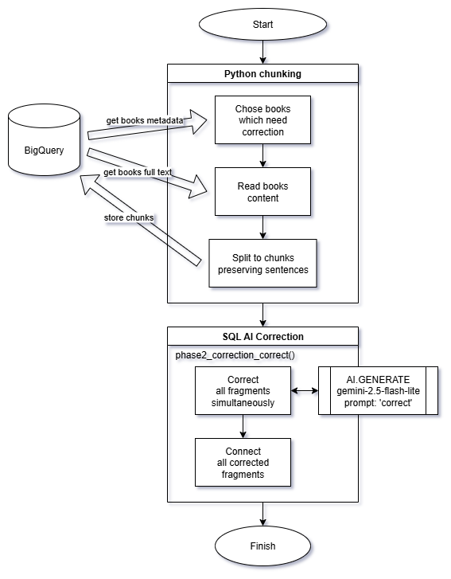
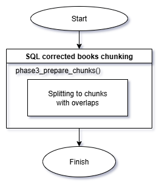
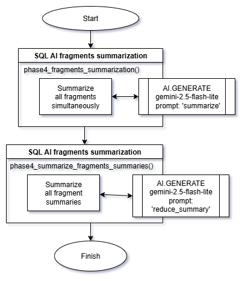
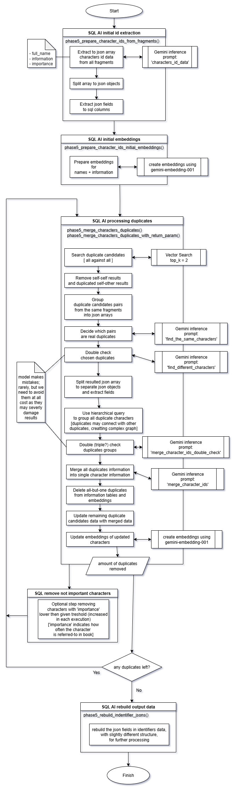
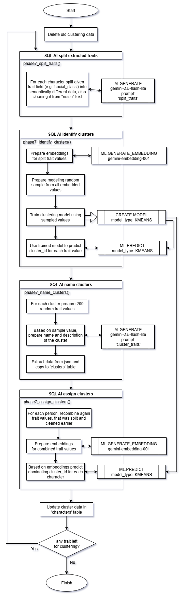

# Book Crawler Architectual Diagram

The processing is divided to several semi-independent stages. For clarity the diagram of each stage is provided separately.

*note: almost all SQL operations are processing all books in parallel*

Phase 1 is responsible of loading books to `book` table. It is not really part of solution, but rather a helper operation to test it, so it's not presented on the diagram.

## Phase 2 - Book Correction

Performs correction of OCR book scanning errors. Such errors are quite common in books from GDELT Processes Internet Archive.

## Phase 3 - Chunking

Simple divide of each book to overlaping fragments.

## Phase 4 - Summarizing

Prepare concise summary of each book. It will be supplementary information in inference operations later.

## Phase 5 - Character identification

The core part of the project, resposible for consistent matching of human characters across the whole span of the story.

## Phase 6 - Extracting information

This stage is finally gathering the data we want. In this project I chose as an example: gender, financial status, social class and values & priorities.

In real life applications, any type of information can be chosen.

## Phase 7 - Clustering

It takes the raw data gathered for each interesting us trait and clusters them together into consistent groups.

The cluster sizes are set arbitrary and can be freely changed (they are params in last three cells in processing notebook or in clustering notebook). Running [bc_phase7_clustering_traits](https://github.com/jj123451/book_crawler/tree/main/split_notebooks) again, will regenerate clusters without damaging other data.

There is probably no best clusters number. In model tests, Davies-Bouldin index was improving while cluster number rose to ridiculus numbers.
Also other analysis, like HDBSCAN, showed very large cluster numbers. 

Despite all this, the clustering works quite well, but may need multiple trial and errors in chosing optimal numbers. (note: for small number of data, the clustering may not work correctly).

