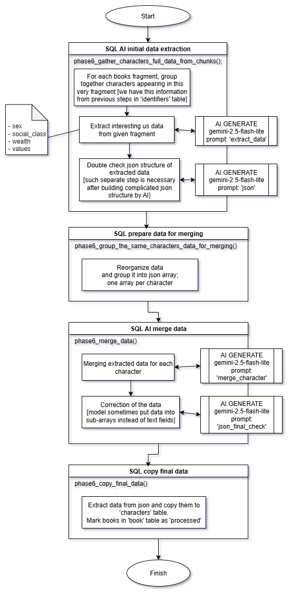

# Book Crawler Architectural Diagram

The processing is divided into several semi-independent stages. For clarity, the diagram of each stage is presented separately.

*Note: almost all SQL operations process all books in parallel.*

Phase 1 is responsible for loading books into the `book` table. It is not really part of the core solution, but rather a helper operation for testing, so it is not shown in the diagrams.

---

## Phase 2 – Book Correction

Corrects OCR scanning errors, which are quite common in books from the GDELT Processed Internet Archive.

---

## Phase 3 – Chunking

Divides each book into overlapping fragments.

---

## Phase 4 – Summarization

Generates concise summaries of each book. These summaries are later used as supplementary information during inference operations.

---

## Phase 5 – Character Identification

The core of the project, responsible for consistently matching human characters across the entire span of a story.

---

## Phase 6 – Information Extraction

This stage gathers the actual data of interest.  
In this project, the example attributes are: gender, financial status, social class, and values & priorities.  

In real-world applications, any type of information could be extracted.

---

## Phase 7 – Clustering

Groups the raw data for each trait of interest into consistent clusters.  

Cluster sizes are set arbitrarily and can be freely adjusted (they are parameters in the last three cells of the processing notebook, or in the clustering notebook).  
Running [bc_phase7_clustering_traits](https://github.com/jj123451/book_crawler/tree/main/split_notebooks) again will regenerate the clusters without affecting other data.

There is no single “best” number of clusters.  
- In tests, the Davies–Bouldin index kept improving as the number of clusters increased to impractically high values.  
- Other analyses, such as HDBSCAN, also suggested very large cluster numbers.  

Despite this, clustering works quite well, though it may require multiple trials to find an optimal balance.  
*Note: with very small datasets, clustering may not work correctly.*

