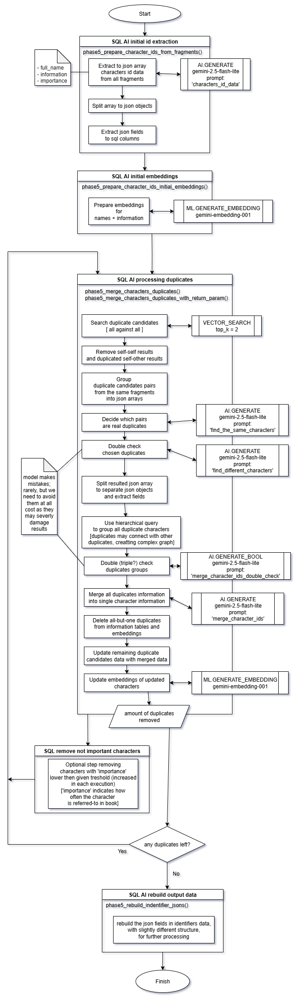

# Book Crawler Architectual Diagram

The processing is divided to several semi-independent stages. For clarity the diagram of each stage of processing is provided separately.

*note: Every SQL operation, both involving AI and not, is processing in parallel all the books. It is therfore much more efficient to load and process multiple books at once.*

Phase 1 consist of loading books to `book` table. It is helper operation to test the solution so it's not presented on the diagram.

## Phase 2 - Book Correction

Book correction performs correction of OCR book scanning errors. Such errors are quite common in books from GDELT Processes Internet Archive.

## Phase 3 - Chunking

Simple divide of each book to overlaping fragments.

## Phase 4 - Summarizing

Prepare concise summary of each book. It will be supplementary information in several inference operations later.

## Phase 5 - Character identification

By far the most crucial part of whole project. 
Can take a lot of time, e.g. extraction of chuman characters in 3 million chars long adventure book took from 15 to 30 minutes (depends probably on cloud servers load)

## Phase 6 - Extracting information

This stage is finally gathering the data we want. In this project we chose as an example: gender, financial status, social class and moral values.
In real life applications, any chosen traits can be chosen, by adapting prompts and param values in clustering stage.

## Phase 7 - Clustering

It takes the raw data gathered for each interesting us trait and clusters them together into consistent groups.
The cluster sizes are chosen arbitrary and can be changed in last three cells in processing notebook or in clustering notebook.
There is probably no best clusters number. In model tests, Davies-Bouldin index was improving while cluster number rose to ridiculus numbers.
Also other analysis, like HDBSCAN, showed very large cluster numbers. 

Despite all this, the clustering works quite well, but may need multiple trial and errors in chosing optimal numbers.
Running [bc_phase7_clustering_traits](https://github.com/jj123451/book_crawler/tree/main/split_notebooks) again, will regenerate clusters without damaging the core data.

